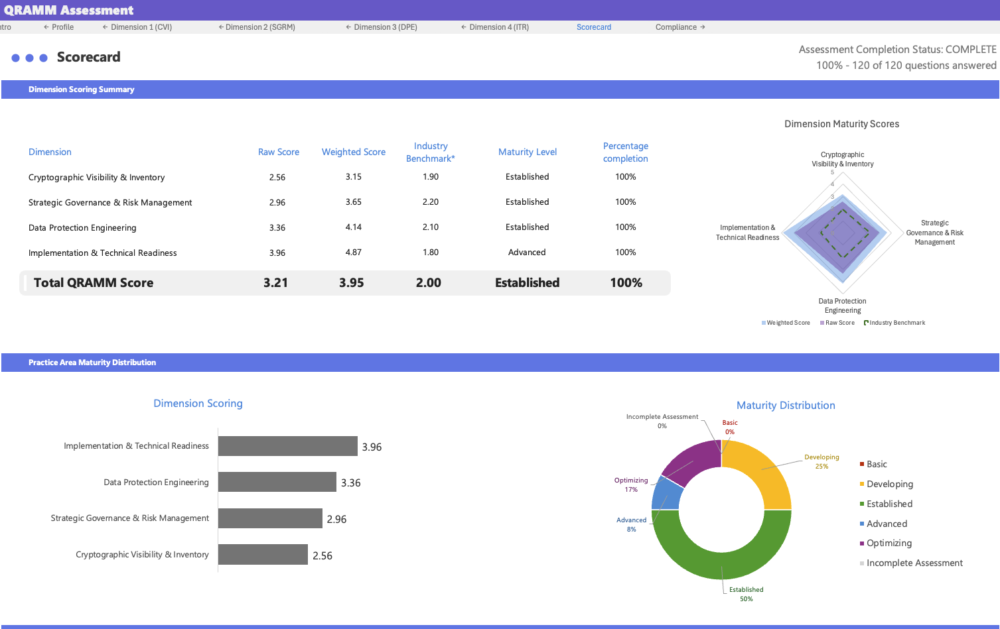
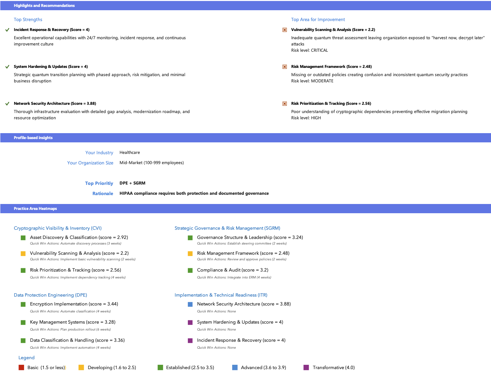
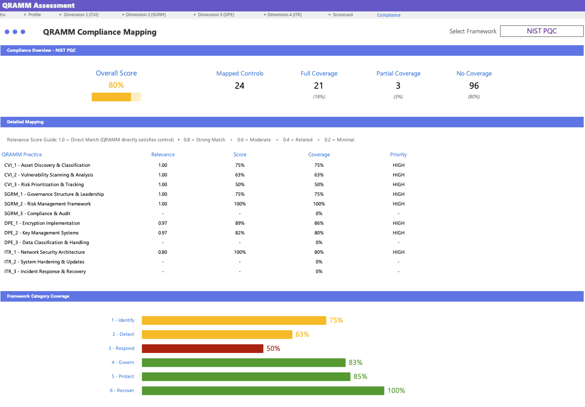
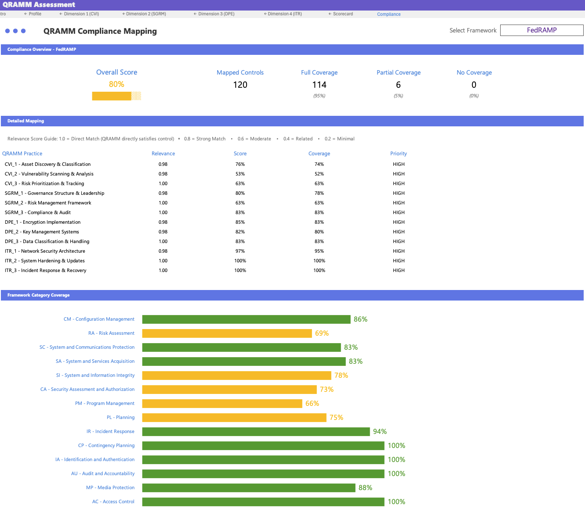

# QuantumGuard: Quantum Readiness Assurance Maturity Model

<div align="center">

[](LICENSE)
[](https://github.com/csnp/QuantumGuard/stargazers)
[](https://csrc.nist.gov/projects/post-quantum-cryptography)
[](https://QuantumGuard.org)

**The Industry-Leading Open Source Framework for Organizational Quantum Readiness**

[**Visit Website**](https://QuantumGuard.org) | [**Download Toolkit**](toolkit/QuantumGuard_Assessment_Toolkit.xlsx) | [**Sample Toolkit**](toolkit/Sample_Assessment.xlsx) | [**Toolkit Overview**](toolkit/toolkit-overview.md) | [**Framework Docs**](framework/quantumguard-overview.md)

</div>

---

## Open Source Tools

QuantumGuard provides a suite of open source tools to support your quantum readiness journey:

| Tool | Description | Repository |
|------|-------------|------------|
| **CryptoScan** | Cryptographic discovery scanner - scans codebases for quantum-vulnerable algorithms with SARIF and CBOM output | [GitHub](https://github.com/csnp/QuantumGuard-cryptoscan) |
| **TLS Analyzer** | TLS/SSL configuration analyzer - evaluates cipher suites and certificates with CNSA 2.0 compliance tracking | [GitHub](https://github.com/csnp/QuantumGuard-tls-analyzer) |
| **CryptoDeps** | Dependency crypto analyzer - identifies quantum-vulnerable algorithms in your software supply chain | [GitHub](https://github.com/csnp/QuantumGuard-cryptodeps) |

These tools integrate with the QuantumGuard framework to provide automated discovery and assessment capabilities for Dimension 1 (Cryptographic Visibility & Inventory). See the [Open Source Tools page](https://QuantumGuard.org/open-source-tools.html) for detailed guides.

---

## Executive Summary

The **Quantum Readiness Assurance Maturity Model (QuantumGuard)** is an evidence-based framework designed to help enterprises systematically prepare for the quantum computing threat to current cryptographic systems. Developed by cybersecurity experts at CyberSecurity NonProfit (CSNP), QuantumGuard provides the structured approach organizations need to:

- **Assess** current quantum vulnerability across all cryptographic assets
- **Plan** strategic transition to quantum-safe cryptography
- **Implement** post-quantum security measures with minimal disruption
- **Validate** quantum readiness through continuous monitoring

With quantum computers capable of breaking RSA-2048 encryption expected within 5-10 years, organizations must act now to protect long-term sensitive data and maintain business continuity.

## Business Value Proposition

### For Executive Leadership
- **Clear ROI**: Quantifiable risk reduction and compliance assurance
- **Competitive Advantage**: Early adoption positions your organization as a security leader
- **Board-Ready Reporting**: Executive dashboards and maturity visualizations
- **Regulatory Compliance**: Meet emerging quantum security requirements

### For Security Professionals
- **Comprehensive Coverage**: Only framework addressing all aspects of quantum readiness
- **Technical Depth**: Detailed implementation guidance and best practices
- **Tool Integration**: Compatible with existing security infrastructure
- **Community Support**: Active community of practitioners and experts

### For Compliance Teams
- **Standards Alignment**: Full compatibility with NIST, ISO, and industry standards
- **Audit Trail**: Complete documentation for regulatory assessments
- **Risk Frameworks**: Integrated with enterprise risk management
- **Evidence Collection**: Systematic approach to compliance demonstration

## The Quantum Threat Timeline

<div align="center">

| Timeline | Event | Impact |
|----------|-------|---------|
| **2024-2025** | Initial assessments begin | Organizations start quantum readiness journey |
| **2026-2028** | NIST standards adoption | Regulatory requirements emerge |
| **2029-2032** | Quantum computers emerge | Current encryption vulnerable |
| **2033+** | Widespread quantum computing | Unprepared organizations at severe risk |

**CRITICAL: Data encrypted today can be harvested now and decrypted later**

</div>

## QuantumGuard Framework Architecture

### Four Integrated Dimensions

#### **Dimension 1: Cryptographic Visibility & Inventory (CVI)**
*Foundation: Understanding and cataloging cryptographic assets across the organization*

**What It Does**: CVI establishes comprehensive visibility into your cryptographic landscape—discovering every algorithm, key, certificate, and protocol across all systems. It transforms invisible cryptographic dependencies into a manageable asset inventory.

**Why It's Critical**: Without knowing what cryptographic assets you have and where they're deployed, planning a quantum-safe transition becomes impossible. CVI enables proactive, risk-based planning instead of reactive scrambling.

**Key Value**: 
- Discovers hidden quantum vulnerabilities in legacy systems and third-party components
- Maps cryptographic dependencies to prevent migration failures
- Enables data-driven prioritization based on actual risk
- Identifies compliance gaps before they become violations

**Practice Areas**:
- **Practice 1.1**: Cryptographic Discovery & Inventory Management
- **Practice 1.2**: Vulnerability Assessment & Classification  
- **Practice 1.3**: Cryptographic Dependency Mapping

#### **Dimension 2: Strategic Governance & Risk Management (SGRM)**
*Leadership: Leadership commitment and systematic risk management for quantum threats*

**What It Does**: SGRM establishes the organizational foundation for quantum readiness through executive leadership, comprehensive policies, and integrated risk management. It transforms quantum security from an IT project into a strategic business imperative.

**Why It's Critical**: Quantum-safe transformation requires years of sustained effort, significant investment, and enterprise-wide coordination. Without executive commitment and governance, initiatives fail to secure resources and organizational authority.

**Key Value**:
- Establishes board-level accountability for quantum security
- Secures dedicated funding for multi-year transformation
- Breaks down organizational silos for coordinated response
- Aligns quantum readiness with regulatory compliance
- Extends governance to supply chain partners

**Practice Areas**:
- **Practice 2.1**: Executive Leadership & Policy Management
- **Practice 2.2**: Risk Assessment & Compliance Management
- **Practice 2.3**: Third-Party & Supply Chain Risk Management

#### **Dimension 3: Data Protection Engineering (DPE)**
*Protection: Technical implementation of quantum-safe data protection measures*

**What It Does**: DPE implements the technical controls that protect sensitive information against quantum threats across all data states—at rest, in transit, and in use. It delivers real security through quantum-resistant encryption and comprehensive key management.

**Why It's Critical**: Data is the ultimate target. Current encryption will become vulnerable to quantum decryption, threatening everything from financial records to healthcare data. DPE addresses the "harvest now, decrypt later" threat.

**Key Value**:
- Protects long-term sensitive data against future quantum threats
- Replaces vulnerable algorithms before they fail
- Establishes cryptographic agility for evolving standards
- Maintains operational efficiency with optimized implementations
- Ensures compliance with data protection regulations

**Practice Areas**:
- **Practice 3.1**: Data Classification & Protection Requirements
- **Practice 3.2**: Storage Security & Encryption Management
- **Practice 3.3**: Transit Security & Protocol Management

#### **Dimension 4: Implementation & Technical Readiness (ITR)**
*Execution: Execution capabilities for quantum-safe technology deployment*

**What It Does**: ITR bridges the gap between planning and reality, ensuring successful deployment, integration, and maintenance of quantum-resistant technologies. It transforms strategic intentions into operational systems while maintaining business continuity.

**Why It's Critical**: The best strategy fails without effective implementation. ITR prevents common failures—from performance problems to integration issues—that derail quantum initiatives. It makes the difference between talking about quantum security and achieving it.

**Key Value**:
- Prevents implementation failures through systematic planning
- Manages complex integrations between new and legacy systems
- Optimizes performance to maintain operational efficiency
- Builds organizational capabilities for long-term success
- Ensures smooth transitions without business disruption

**Practice Areas**:
- **Practice 4.1**: Technology Infrastructure Assessment
- **Practice 4.2**: Integration Planning and Implementation
- **Practice 4.3**: Operational Readiness and Maintenance

### Five-Level Maturity Model

| Level | Name | Characteristics | Typical Organizations |
|-------|------|-----------------|----------------------|
| **1** | **Basic** | Ad-hoc practices, limited awareness | Most organizations today |
| **2** | **Developing** | Initial structured approach emerging | Security-conscious enterprises |
| **3** | **Established** | Systematic implementation organization-wide | Industry leaders |
| **4** | **Advanced** | Optimized processes, continuous improvement | High-security sectors |
| **5** | **Optimizing** | Industry leadership, innovation driver | Global security pioneers |

## Implementation Roadmap

### Phase 1: Discovery & Assessment (3-6 months)
- Complete QuantumGuard assessment across all dimensions
- Identify cryptographic assets and vulnerabilities
- Establish baseline maturity levels
- Develop executive briefing materials

### Phase 2: Planning & Prioritization (2-4 months)
- Create quantum readiness strategy
- Prioritize critical systems and data
- Allocate resources and budget
- Obtain executive approval

### Phase 3: Pilot Implementation (6-12 months)
- Deploy quantum-safe technologies in test environments
- Validate performance and compatibility
- Refine processes and procedures
- Build organizational capabilities

### Phase 4: Enterprise Rollout (12-24 months)
- Systematic deployment across organization
- Continuous monitoring and optimization
- Regular maturity reassessment
- Industry collaboration and knowledge sharing

## Scoring System & Methodology

### Assessment Structure
- **120 Total Questions**: Complete assessment framework
- **30 Questions per Dimension**: In-depth evaluation of each area
- **10 Questions per Practice**: Detailed assessment of 12 practices
- **4 Answer Options**: Each question has 4 options mapping to 5 maturity levels

### Scoring Calculation
```
Dimension Score = Average of practice scores within dimension
Overall QuantumGuard Score = Average of all dimension scores
Maturity Level = Derived from overall score thresholds
```

### Maturity Thresholds
- **Level 1 (Basic)**: Score 1.0 - 1.5
- **Level 2 (Developing)**: Score 1.6 - 2.5
- **Level 3 (Established)**: Score 2.6 - 3.5
- **Level 4 (Advanced)**: Score 3.6 - 3.9
- **Level 5 (Optimizing)**: Score 4.0 (Perfect score demonstrating excellence)

## QuantumGuard Assessment Toolkit Now Available

The comprehensive Excel-based QuantumGuard Assessment Toolkit is now available for download! This toolkit features:
- **Automated Scoring**: Instant calculation of raw and weighted scores across all dimensions
- **Dynamic Scorecards**: Professional visualizations including charts, graphs, and maturity distribution
- **Organization Profile Multiplier**: Risk-adjusted scoring based on your industry and context
- **Compliance Mapping**: Automatic mapping to 8 major frameworks (NIST, CMMC, ISO, etc.)
- **120 Assessment Questions**: Complete coverage across 4 dimensions and 12 practices
- **Executive Reporting**: Board-ready dashboards with benchmarking and recommendations

[**Download the Toolkit**](toolkit/QuantumGuard_Assessment_Toolkit.xlsx) | [**View Sample Assessment**](toolkit/Sample_Assessment.xlsx) | [**Read Toolkit Overview**](toolkit/toolkit-overview.md)

## Toolkit Visual Examples

### Scorecard Dashboard
<div align="center">
  
  <p><em>Comprehensive scorecard showing dimension scores, weighted adjustments, and maturity visualization</em></p>
</div>

<div align="center">
  
  <p><em>Detailed practice-level analysis with maturity distribution and improvement recommendations</em></p>
</div>

### Compliance Mapping
<div align="center">
  
  <p><em>NIST Post-Quantum Cryptography framework mapping with coverage analysis</em></p>
</div>

<div align="center">
  
  <p><em>FedRAMP compliance mapping showing 95% coverage across security controls</em></p>
</div>

## Getting Started

### 1. Quick Assessment (Recommended First Step)
**Time**: 5-10 minutes
**Link**: [https://QuantumGuard.org](https://QuantumGuard.org)
**Output**: Instant maturity score, radar charts, priority recommendations

### 2. Download Resources
- [Executive Report Template](https://github.com/csnp/QuantumGuard/blob/main/templates/executive-report-template.md)
- [Asset Inventory Template](https://github.com/csnp/QuantumGuard/blob/main/templates/asset-inventory-template.md)
- [Vendor Assessment Questionnaire](https://github.com/csnp/QuantumGuard/blob/main/templates/vendor-questionnaire-template.md)
- [Evidence Collection Template](https://github.com/csnp/QuantumGuard/blob/main/templates/evidence-collection-template.md)

### 3. Engage Stakeholders
- Present assessment results to executive leadership
- Establish quantum readiness working group
- Allocate initial resources for planning phase

## Repository Structure

```
QuantumGuard/
├── framework/              # Framework documentation
│   ├── quantumguard-overview.md       # Executive framework summary
│   ├── maturity-levels.md      # 5-level maturity progression
│   ├── scoring-methodology.md  # Scoring system details
│   ├── compliance-mapping.md   # Standards alignment details
│   └── Complete_QuantumGuard_Questions.md  # All 120 assessment questions
├── toolkit/                # Assessment tools
│   ├── QuantumGuard_Assessment_Toolkit.xlsx  # Main Excel assessment tool
│   ├── Sample_Assessment.xlsx         # Pre-filled example
│   └── toolkit-overview.md            # Feature documentation
├── implementation/         # Implementation guidance
│   └── getting-started.md      # Getting started guide
├── templates/              # Ready-to-use templates
│   ├── executive-report-template.md
│   ├── asset-inventory-template.md
│   ├── vendor-questionnaire-template.md
│   └── evidence-collection-template.md
├── assets/                 # Visual assets
│   └── toolkit-visuals/        # Scorecard and compliance screenshots
└── toolkit-specs/          # Technical specifications (internal)
```

## Regulatory Compliance & Standards

### Standards Alignment
The QuantumGuard Toolkit maps to 8 major frameworks and standards:

| Framework | Description |
|-----------|-------------|
| **NIST PQC** | NIST Post-Quantum Cryptography Standards |
| **NSM 10** | National Security Memorandum quantum readiness mandates |
| **CNSA 2.0** | NSA Commercial National Security Algorithm Suite |
| **ISO/IEC 27001:2022** | Information security management |
| **ETSI QSC** | European quantum-safe cryptography standards |
| **CMMC** | Cybersecurity Maturity Model Certification |
| **FedRAMP** | Federal Risk and Authorization Management Program |
| **NIST CSF** | NIST Cybersecurity Framework |

## Support & Resources

For questions about QuantumGuard implementation or framework guidance, contact: [QuantumGuard@csnp.org](mailto:QuantumGuard@csnp.org)

### Community Resources
- **GitHub Discussions**: [Join the conversation](https://github.com/csnp/QuantumGuard/discussions)

## Framework Development

### Leadership Team

**Emily (Stamm) Fane** - *Author*  
VP of CSNP Board  
[LinkedIn](https://www.linkedin.com/in/emily-stamm/)

**Abdel Fane** - *Co-Author*  
Executive Director of CSNP  
[LinkedIn](https://www.linkedin.com/in/abdelsyfane/)

**Organization**: [CyberSecurity NonProfit (CSNP)](https://csnp.org)

### Contributing
QuantumGuard is an open-source initiative welcoming contributions from:
- Security professionals
- Quantum researchers
- Enterprise architects
- Compliance specialists

## License & Usage

QuantumGuard is released under the **MIT License**, providing:
- Commercial use
- Modification
- Distribution
- Patent use
- Private use

### Citation
```bibtex
@software{QuantumGuard2025,
  title = {QuantumGuard: Quantum Readiness Assurance Maturity Model},
  author = {Fane, Emily and Fane, Abdel},
  organization = {CyberSecurity NonProfit (CSNP)},
  year = {2025},
  url = {https://QuantumGuard.org}
}
```

## Frequently Asked Questions

### Q: How long does a QuantumGuard assessment take?
**A**: Quick assessment: 5-10 minutes. Comprehensive assessment: 2-4 hours with stakeholder input and evidence gathering.

### Q: Is QuantumGuard suitable for small organizations?
**A**: Yes. QuantumGuard scales from small businesses to global enterprises with tailored implementation paths.

### Q: How often should we reassess?
**A**: Quarterly for critical systems, annually for full organizational assessment.

### Q: Do we need quantum experts?
**A**: No. QuantumGuard provides all necessary guidance. Expert consultation available for complex implementations.

## Next Steps

<div align="center">

### Start Your Quantum Readiness Journey Today

1. **[Take the Assessment](https://QuantumGuard.org)** - Get your baseline score in minutes
2. **[Download Templates](https://github.com/csnp/QuantumGuard/tree/main/templates)** - Accelerate implementation

**The quantum threat is approaching. Organizations that act now will thrive in the post-quantum era.**

---

*QuantumGuard is a trademark of CyberSecurity NonProfit (CSNP)*  
*© 2025 CSNP. All rights reserved.*

</div>
