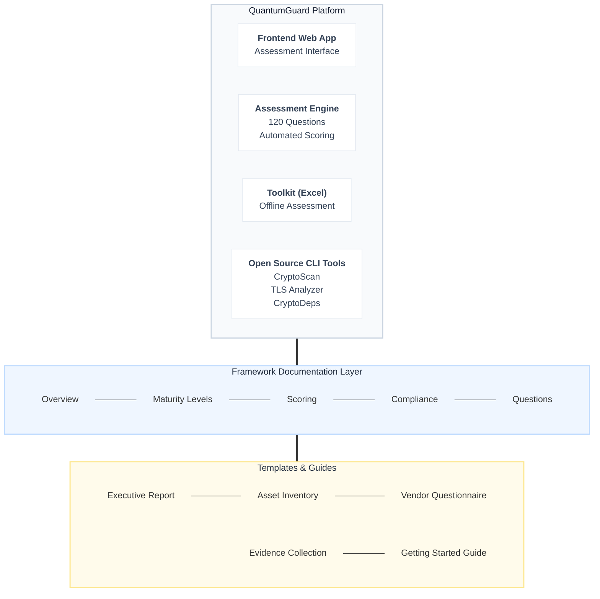
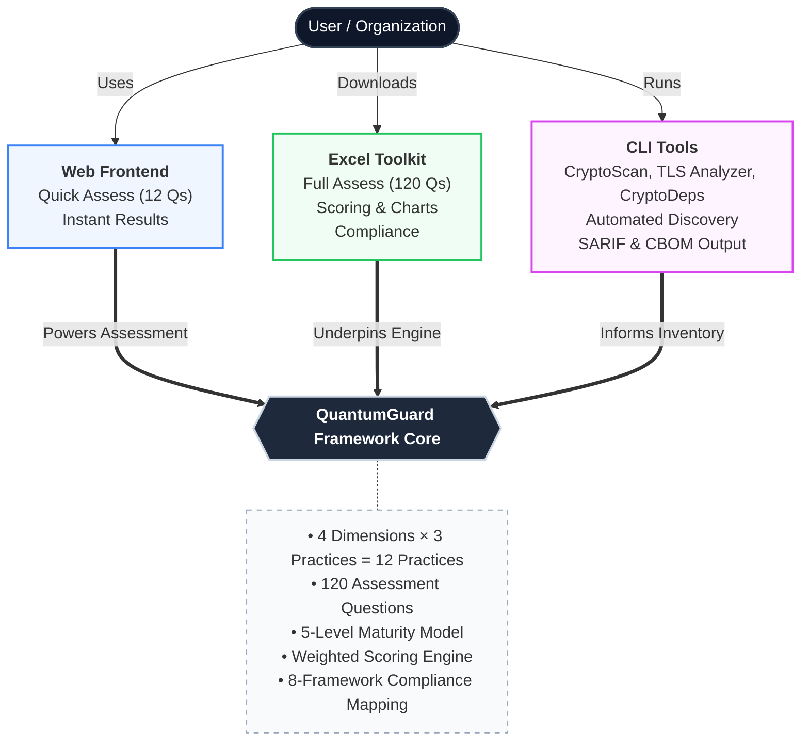
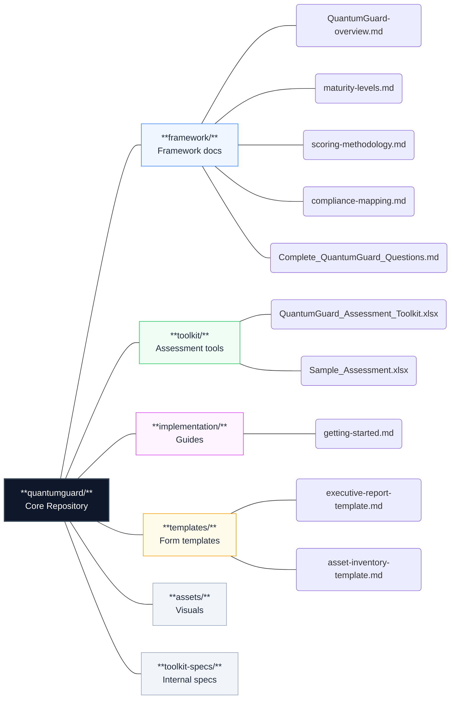

# Software Requirement Specification

**Project Name:** QuantumGuard — Post Quantum Cryptography Scanner

**Team Name:** [Insert Team Name]

**Institute Name:** [Insert Institute Name]

**Date:** March 15, 2026

**PSB Hackathon 2026**

---

## 1. Introduction

### 1.1 Purpose

This Software Requirements Specification (SRS) defines the complete functional and non-functional requirements for **QuantumGuard** — a comprehensive platform for organizational quantum readiness assessment, planning, and continuous improvement. QuantumGuard enables enterprises to systematically evaluate their vulnerability to quantum computing threats and transition to quantum-safe cryptography.

### 1.2 Scope

QuantumGuard encompasses:

- **Web-based Assessment Platform** — Interactive frontend providing Quick (12-question) and Comprehensive (120-question) assessments
- **Excel-based Toolkit** — Downloadable `QuantumGuard_Assessment_Toolkit.xlsx` with automated scoring, compliance mapping, and executive dashboards
- **Framework Documentation** — 8 core framework documents covering overview, maturity levels, scoring methodology, compliance mapping, and all 120 questions
- **Open Source Scanning Tools** — Three companion CLI tools (CryptoScan, TLS Analyzer, CryptoDeps) for automated cryptographic discovery
- **Templates Library** — Ready-to-use templates for executive reports, asset inventories, vendor questionnaires, and evidence collection
- **Implementation Guidance** — Step-by-step getting-started guide with phased implementation roadmap

### 1.3 Definitions, Acronyms, and Abbreviations

| Term | Definition |
|---|---|
| **QuantumGuard** | Quantum Readiness Assurance Maturity Model — the renamed project (formerly QRAMM) |
| **PQC** | Post-Quantum Cryptography |
| **CVI** | Cryptographic Visibility & Inventory (Dimension 1) |
| **SGRM** | Strategic Governance & Risk Management (Dimension 2) |
| **DPE** | Data Protection Engineering (Dimension 3) |
| **ITR** | Implementation & Technical Readiness (Dimension 4) |
| **ML-KEM** | Module-Lattice-Based Key-Encapsulation Mechanism (FIPS 203) |
| **ML-DSA** | Module-Lattice-Based Digital Signature Standard (FIPS 204) |
| **SLH-DSA** | Stateless Hash-Based Digital Signature Standard (FIPS 205) |
| **CNSA 2.0** | NSA Commercial National Security Algorithm Suite |
| **Y2Q** | "Years to Quantum" — estimated time until cryptographically-relevant quantum computers |
| **CBOM** | Cryptographic Bill of Materials |
| **SARIF** | Static Analysis Results Interchange Format |
| **CSNP** | CyberSecurity NonProfit |

### 1.4 References

| Reference | Description |
|---|---|
| NIST IR 8547 | Transition to Post-Quantum Cryptography Standards |
| NIST SP 800-131A Rev. 2 | Transitioning the Use of Cryptographic Algorithms |
| FIPS 203 / 204 / 205 | NIST PQC Standards (ML-KEM, ML-DSA, SLH-DSA) |
| CMMC 2.0 | Cybersecurity Maturity Model Certification |
| FedRAMP | Federal Risk and Authorization Management Program |
| ISO/IEC 27001:2022 | Information Security Management |
| ETSI QSC | European Quantum-Safe Cryptography Standards |
| NIST CSF | NIST Cybersecurity Framework |
| NSM-10 | National Security Memorandum — Quantum Readiness |
| M-23-02 | OMB Memorandum on Quantum Computing Risks |

### 1.5 Document Overview

This SRS follows a modified IEEE 830 / ISO/IEC/IEEE 29148 structure. It covers both the existing system (framework, toolkit, website, companion tools) and defines requirements for their continued development under the QuantumGuard brand.

---

## 2. Overall Description

### 2.1 Product Perspective

QuantumGuard is an **open-source cybersecurity maturity framework** developed by CSNP. It is a standalone system composed of:



### 2.2 Product Functions

QuantumGuard performs the following high-level functions:

| # | Function | Description |
|---|---|---|
| F1 | **Quantum Readiness Assessment** | Evaluate organizational maturity across 4 dimensions, 12 practices, 120 questions |
| F2 | **Automated Scoring** | Calculate practice, dimension, and overall scores with weighted adjustments |
| F3 | **Maturity Level Classification** | Map scores to 5-level maturity model (Basic → Optimizing) |
| F4 | **Compliance Mapping** | Map assessment results to 8 major regulatory frameworks |
| F5 | **Gap Analysis** | Identify weaknesses and prioritize improvement areas |
| F6 | **Executive Reporting** | Generate board-ready dashboards, charts, and recommendations |
| F7 | **Cryptographic Discovery** | Scan codebases for quantum-vulnerable algorithms (CryptoScan) |
| F8 | **TLS/SSL Analysis** | Evaluate cipher suites and certificates (TLS Analyzer) |
| F9 | **Dependency Analysis** | Identify quantum-vulnerable algorithms in supply chain (CryptoDeps) |
| F10 | **Template Generation** | Provide ready-to-use documents for implementation processes |

### 2.3 User Classes and Characteristics

| User Class | Description | Primary Interactions |
|---|---|---|
| **Executive Leadership** (CISO, CTO, CRO) | Strategic decision-makers needing high-level visibility | Quick Assessment, Executive Dashboard, Compliance Reports |
| **Security Professionals** | Technical practitioners conducting assessments and implementations | Comprehensive Assessment, CLI Tools, Gap Analysis |
| **Compliance Teams** | Regulatory and compliance staff managing audit requirements | Compliance Mapping, Evidence Collection, Vendor Questionnaires |
| **IT Operations** | Infrastructure and operations teams managing deployments | Implementation Guide, Infrastructure Assessment, CLI Tools |
| **Third-Party Vendors** | External partners subject to quantum readiness requirements | Vendor Questionnaire, Self-Assessment |
| **Community Contributors** | Open-source contributors improving the framework | GitHub Repository, Documentation |

### 2.4 Operating Environment

| Component | Environment |
|---|---|
| **Frontend Web App** | Modern web browsers (Chrome, Firefox, Safari, Edge) — responsive design supporting desktop and mobile |
| **Excel Toolkit** | Microsoft Excel 2016+ or compatible spreadsheet software (LibreOffice Calc) |
| **CLI Tools** | Cross-platform (Windows, macOS, Linux) — Node.js / Python runtime |
| **Documentation** | GitHub-hosted Markdown, rendered on project website |
| **Repository** | GitHub |

### 2.5 Design and Implementation Constraints

| Constraint | Details |
|---|---|
| **License** | MIT License — all components must remain open-source |
| **Standards Alignment** | Must remain aligned with active NIST PQC, CMMC, FedRAMP, FISMA, ISO 27001, ETSI QSC, CNSA 2.0, NSM-10 standards |
| **Accessibility** | Framework must remain accessible without requiring paid tools or proprietary software |
| **Backward Compatibility** | Assessment results from prior versions must remain interpretable |
| **Offline Capability** | Excel toolkit must function fully offline without internet connectivity |

### 2.6 Assumptions and Dependencies

| # | Assumption/Dependency |
|---|---|
| A1 | Users have basic cybersecurity knowledge and organizational awareness |
| A2 | Organizations have access to relevant stakeholders for comprehensive assessment |
| A3 | NIST PQC standards continue to evolve and QuantumGuard must track updates |
| A4 | The quantum threat timeline (5–15 years) remains the generally accepted industry estimate |
| A5 | Excel-based toolkit relies on Microsoft Excel or compatible software with macro/formula support |
| D1 | CryptoScan, TLS Analyzer, and CryptoDeps are maintained in separate GitHub repositories |
| D2 | The QuantumGuard.org website is hosted and maintained independently |

---

## 3. System Architecture

### 3.1 High-Level Architecture



### 3.2 Component Architecture

#### 3.2.1 Repository Structure (Current)



---

## 4. Functional Requirements

### 4.1 Assessment Engine

#### FR-001 — Quick Assessment

| Field | Value |
|---|---|
| **ID** | FR-001 |
| **Priority** | High |
| **Description** | The system shall provide a Quick Assessment mode with 12 questions (3 per dimension) that produces an instant baseline score and prioritized recommendations. |
| **Input** | 12 multiple-choice responses (4 options each) |
| **Output** | Overall QuantumGuard score, maturity level, radar chart, per-dimension scores, priority recommendations |
| **Acceptance Criteria** | User completes in ≤10 minutes; results display immediately without page reload; PDF/print export available |

#### FR-002 — Comprehensive Assessment

| Field | Value |
|---|---|
| **ID** | FR-002 |
| **Priority** | High |
| **Description** | The system shall provide a Comprehensive Assessment with 120 questions (30 per dimension, 10 per practice) organized in two streams: Stream A (Foundation, 60% weight) and Stream B (Advanced, 40% weight). |
| **Input** | 120 multiple-choice responses (4 options each, scoring 1–4) |
| **Output** | Practice-level scores, dimension scores (MIN of practices), overall score, maturity level, gap analysis, compliance mapping |
| **Acceptance Criteria** | Supports save/resume; progress indicator shows completion %; all 12 practices covered |

#### FR-003 — Scoring Calculation

| Field | Value |
|---|---|
| **ID** | FR-003 |
| **Priority** | High |
| **Description** | The system shall calculate scores using the defined methodology. |
| **Formulas** | `Practice Score = Σ(10 question scores) / 10`; `Dimension Score = MIN(Practice1, Practice2, Practice3)`; `Overall Score = (CVI + SGRM + DPE + ITR) / 4` |
| **Maturity Thresholds** | Level 1 (1.0–1.4), Level 2 (1.5–2.4), Level 3 (2.5–3.4), Level 4 (3.5–3.9), Level 5 (4.0) |
| **Weighted Scoring** | Organization Profile multiplier (0.8×–1.5×) adjusts raw scores based on industry, regulatory, scale, data sensitivity, tech complexity |

#### FR-004 — Organization Profile Configuration

| Field | Value |
|---|---|
| **ID** | FR-004 |
| **Priority** | Medium |
| **Description** | The system shall capture organizational context to calculate a profile multiplier (0.8×–1.5×) based on: industry requirements, regulatory obligations, organizational scale, data sensitivity, and technology complexity. |
| **Acceptance Criteria** | Weighted scores can exceed 4.0 for high-risk profiles; N/A responses do not affect scoring |

#### FR-005 — Gap Analysis

| Field | Value |
|---|---|
| **ID** | FR-005 |
| **Priority** | High |
| **Description** | The system shall identify and prioritize gaps at practice, stream, dimension, and question levels. |
| **Gap Types** | Practice-level gaps (below target), stream imbalances (Foundation vs Advanced), dimension weaknesses, critical deficiencies |
| **Prioritization** | By business impact, risk exposure, implementation complexity, timeline constraints |

#### FR-006 — Save and Resume

| Field | Value |
|---|---|
| **ID** | FR-006 |
| **Priority** | Medium |
| **Description** | The system shall allow users to save assessment progress and resume later without data loss. |
| **Acceptance Criteria** | Progress persists across browser sessions; completion status accurately tracked |

### 4.2 Compliance Mapping Module

#### FR-007 — Multi-Framework Compliance Mapping

| Field | Value |
|---|---|
| **ID** | FR-007 |
| **Priority** | High |
| **Description** | The system shall map each of the 120 assessment questions to controls in 8 compliance frameworks: NIST PQC, NSM-10, CNSA 2.0, ISO/IEC 27001:2022, ETSI QSC, CMMC 2.0, FedRAMP, and NIST CSF. |
| **Mapping Strength** | Direct (●●●), Strong (●●○), Partial (●○○), Supporting (○○○) |
| **Compliance Score** | `(Direct×1.0 + Strong×0.75 + Partial×0.5 + Supporting×0.25) / Total Requirements` |

#### FR-008 — Compliance Coverage Report

| Field | Value |
|---|---|
| **ID** | FR-008 |
| **Priority** | Medium |
| **Description** | The system shall generate per-framework compliance coverage percentages and identify gaps requiring additional controls. |
| **Output** | Framework-specific coverage %, gap list, recommended actions |

### 4.3 Reporting & Export

#### FR-009 — Executive Dashboard

| Field | Value |
|---|---|
| **ID** | FR-009 |
| **Priority** | High |
| **Description** | The system shall provide a board-ready executive dashboard showing overall score, maturity level, dimension summaries, top strengths, improvement areas, and dynamic recommendations. |

#### FR-010 — Visual Analytics

| Field | Value |
|---|---|
| **ID** | FR-010 |
| **Priority** | High |
| **Description** | The system shall generate interactive charts: dimension scoring bar chart, maturity distribution donut chart, spider/radar chart comparing weighted scores against industry benchmarks. |

#### FR-011 — Export Capabilities

| Field | Value |
|---|---|
| **ID** | FR-011 |
| **Priority** | Medium |
| **Description** | The system shall export assessment results in PDF, Excel, and print-friendly HTML formats. |

### 4.4 Template Management

#### FR-012 — Template Library

| Field | Value |
|---|---|
| **ID** | FR-012 |
| **Priority** | Medium |
| **Description** | The system shall provide downloadable templates: Executive Report, Asset Inventory, Vendor Questionnaire, and Evidence Collection templates. |

#### FR-013 — Template Customization

| Field | Value |
|---|---|
| **ID** | FR-013 |
| **Priority** | Low |
| **Description** | Templates shall auto-populate with organization name, assessment date, and scores where applicable. |

### 4.5 Open Source Tool Integration

#### FR-014 — CryptoScan Integration

| Field | Value |
|---|---|
| **ID** | FR-014 |
| **Priority** | Medium |
| **Description** | The platform shall integrate with the CryptoScan tool to scan codebases for quantum-vulnerable algorithms, producing SARIF and CBOM output. |
| **Supported Dimension** | CVI (Dimension 1) — Cryptographic Visibility & Inventory |

#### FR-015 — TLS Analyzer Integration

| Field | Value |
|---|---|
| **ID** | FR-015 |
| **Priority** | Medium |
| **Description** | The platform shall integrate with the TLS Analyzer to evaluate cipher suites and certificates with CNSA 2.0 compliance tracking. |
| **Supported Dimension** | DPE (Dimension 3) — Data Protection Engineering |

#### FR-016 — CryptoDeps Integration

| Field | Value |
|---|---|
| **ID** | FR-016 |
| **Priority** | Medium |
| **Description** | The platform shall integrate with CryptoDeps to identify quantum-vulnerable algorithms in the software supply chain. |
| **Supported Dimension** | CVI (Dimension 1) — Cryptographic Visibility & Inventory |

---

## 5. Frontend Requirements

### 5.1 Overview

The QuantumGuard frontend is a web application. It provides the primary user-facing interface for quantum readiness assessment, results visualization, and resource access.

### 5.2 Pages & User Flows

#### 5.2.1 Landing Page / Home

| Field | Value |
|---|---|
| **ID** | FE-001 |
| **Route** | `/` |
| **Purpose** | Hero section introducing QuantumGuard; call-to-action for Quick Assessment; value proposition; threat timeline visualization; navigation to all sections |
| **Key Elements** | Hero banner with animated threat timeline; "Start Assessment" CTA button; feature highlights (4 dimensions); testimonials/badges (NIST Aligned, Enterprise Ready); open-source toolkit download links |
| **Responsive** | Desktop, tablet, mobile breakpoints |

#### 5.2.2 Quick Assessment Page

| Field | Value |
|---|---|
| **ID** | FE-002 |
| **Route** | `/assessment/quick` |
| **Purpose** | 12-question rapid assessment covering all 4 dimensions |
| **Key Elements** | Progress stepper (12 steps); question card with 4 radio options per question; dimension indicator; "Next / Previous" navigation; submit button |
| **UX Requirements** | ≤10 minute completion; immediate results on submit; no account required; smooth transitions between questions; mobile-friendly card layout |

#### 5.2.3 Comprehensive Assessment Page

| Field | Value |
|---|---|
| **ID** | FE-003 |
| **Route** | `/assessment/comprehensive` |
| **Purpose** | Full 120-question assessment organized by dimension → practice → question |
| **Key Elements** | Sidebar navigation tree (Dimensions > Practices > Questions); progress bar per dimension; save/resume functionality; question cards with evidence annotation field; completion status tracker |
| **UX Requirements** | Supports multi-session completion; auto-save every 30 seconds; keyboard-navigable; question filtering by answered/unanswered status |

#### 5.2.4 Results Dashboard

| Field | Value |
|---|---|
| **ID** | FE-004 |
| **Route** | `/results` |
| **Purpose** | Display assessment results with visual analytics and actionable recommendations |
| **Key Elements** | Overall QuantumGuard score (large numeral + maturity badge); 4-dimension score cards; radar/spider chart; maturity distribution donut chart; dimension bar chart; top 3 strengths + top 3 improvement areas; dynamic recommendations panel; compliance coverage summary; export buttons (PDF, Excel, Print) |
| **Charts** | Interactive (hover tooltips, click-to-drill-down); color-coded by maturity level (Red=Basic, Orange=Developing, Yellow=Established, Green=Advanced, Blue=Optimizing) |

#### 5.2.5 Compliance Mapping Page

| Field | Value |
|---|---|
| **ID** | FE-005 |
| **Route** | `/compliance` |
| **Purpose** | Show how QuantumGuard practices map to 8 compliance frameworks |
| **Key Elements** | Framework selector tabs (NIST PQC, NSM-10, CNSA 2.0, ISO 27001, ETSI QSC, CMMC, FedRAMP, NIST CSF); coverage percentage per framework; detailed mapping table (Question → Control → Mapping Strength); gap highlighter; evidence collection links |

#### 5.2.6 Open Source Tools Page

| Field | Value |
|---|---|
| **ID** | FE-006 |
| **Route** | `/tools` |
| **Purpose** | Showcase and guide users to the 3 companion CLI tools |
| **Key Elements** | Tool cards (CryptoScan, TLS Analyzer, CryptoDeps) with description, install command, link to GitHub repo; integration guide; output format documentation (SARIF, CBOM); dimension alignment indicator |

#### 5.2.7 Documentation / Framework Page

| Field | Value |
|---|---|
| **ID** | FE-007 |
| **Route** | `/docs` |
| **Purpose** | Serve framework documentation in a searchable, navigable format |
| **Key Elements** | Document sidebar (Overview, Maturity Levels, Scoring, Compliance, Questions); markdown rendering; search functionality; section anchoring; print-friendly styles |

#### 5.2.8 Templates & Downloads Page

| Field | Value |
|---|---|
| **ID** | FE-008 |
| **Route** | `/downloads` |
| **Purpose** | Provide downloadable resources |
| **Key Elements** | Download cards for: QuantumGuard Assessment Toolkit (.xlsx), Sample Assessment (.xlsx), Executive Report Template (.md), Asset Inventory Template (.md), Vendor Questionnaire Template (.md), Evidence Collection Template (.md); Getting Started Guide link |

#### 5.2.9 About / Leadership Page

| Field | Value |
|---|---|
| **ID** | FE-009 |
| **Route** | `/about` |
| **Purpose** | Information about CSNP, framework authors, and community |
| **Key Elements** | Mission statement; author profiles (Emily Fane, Abdel Fane); CSNP information; LinkedIn links; contact form/email; community resources (GitHub Discussions, Issues) |

### 5.3 Frontend Component Specifications

#### 5.3.1 Global Components

| Component | Description |
|---|---|
| **Navigation Bar** | Sticky top nav with logo (QuantumGuard), links: Home, Assessment, Results, Compliance, Tools, Docs, Downloads, About; mobile hamburger menu |
| **Footer** | CSNP branding, license info, social links, copyright, sitemap links |
| **Theme System** | Dark mode (primary) with optional light mode toggle; color palette: quantum-themed (deep blues, purples, cyan accents) |
| **Notification Toast** | Success/error/info messages (save confirmation, export ready, etc.) |
| **Loading States** | Skeleton loaders for chart rendering; spinner for pdf generation |

#### 5.3.2 Assessment Components

| Component | Description |
|---|---|
| **QuestionCard** | Displays question text, 4 radio-button options, optional evidence annotation textarea, dimension/practice badge |
| **ProgressStepper** | Visual step indicator showing current position in assessment flow; clickable steps for navigation |
| **DimensionSidebar** | Collapsible tree: 4 Dimensions → 3 Practices each → 10 Questions each; completion checkmarks |
| **ScoreGauge** | Circular gauge displaying score (1.0–4.0) with color-coded maturity ring |
| **ComplianceBadge** | Small badge showing framework name + coverage % with color coding |

#### 5.3.3 Visualization Components

| Component | Description |
|---|---|
| **RadarChart** | 4-axis radar chart showing dimension scores vs benchmarks; interactive with hover data |
| **BarChart** | Grouped bar chart for dimension comparison (raw vs weighted vs benchmark) |
| **DonutChart** | Maturity distribution showing % of practices at each level |
| **HeatmapGrid** | 12-cell grid (4 dimensions × 3 practices) color-coded by maturity level |
| **TimelineWidget** | Interactive quantum threat timeline (2024–2033+) with organizational position marker |

### 5.4 Frontend Design Requirements

#### 5.4.1 Visual Design

| Requirement | Specification |
|---|---|
| **Design Language** | Modern, premium, security-focused aesthetic with glassmorphism and dynamic gradients |
| **Color Palette** | Primary: Deep Navy (#0A192F), Accent: Quantum Cyan (#00D4FF), Secondary: Violet (#7C3AED), Surface: Dark Glass (#1A1B2E), Success: Emerald (#10B981), Warning: Amber (#F59E0B), Danger: Rose (#F43F5E) |
| **Typography** | Primary: Inter (headings), Secondary: JetBrains Mono (scores/code), Body: system-ui stack |
| **Iconography** | Lucide Icons or Heroicons; quantum-themed custom icons for dimensions |
| **Motion** | Smooth page transitions (300ms ease); number counter animations for scores; chart entry animations; subtle hover micro-interactions |
| **Spacing** | 8px grid system; consistent padding/margin scales |

#### 5.4.2 Responsive Breakpoints

| Breakpoint | Width | Behavior |
|---|---|---|
| **Mobile** | < 768px | Single column; hamburger nav; stacked cards; simplified charts |
| **Tablet** | 768px – 1024px | Two-column layouts; collapsible sidebar; touch-friendly targets (44px min) |
| **Desktop** | > 1024px | Full layout with sidebar; multi-panel dashboard; expanded charts |

#### 5.4.3 Accessibility

| Requirement | Standard |
|---|---|
| **WCAG Compliance** | WCAG 2.1 Level AA minimum |
| **Keyboard Navigation** | All interactive elements navigable via keyboard; visible focus indicators |
| **Screen Readers** | ARIA labels on all interactive elements; semantic HTML structure |
| **Color Contrast** | 4.5:1 minimum contrast ratio for all text |
| **Motion** | Respect `prefers-reduced-motion` media query |

### 5.5 Frontend State Management

| State | Scope | Persistence |
|---|---|---|
| **Assessment Responses** | Session-scoped; 120 answer slots | LocalStorage + optional server-side save |
| **Organization Profile** | Session-scoped | LocalStorage |
| **Calculated Scores** | Derived from responses | Re-computed on change |
| **Theme Preference** | User preference | LocalStorage |
| **Assessment Progress** | Derived from response count | Computed |

### 5.6 Frontend Performance Requirements

| Metric | Target |
|---|---|
| **First Contentful Paint** | < 1.5s |
| **Largest Contentful Paint** | < 2.5s |
| **Time to Interactive** | < 3.5s |
| **Cumulative Layout Shift** | < 0.1 |
| **Lighthouse Score** | ≥ 90 (Performance, Accessibility, SEO, Best Practices) |
| **Bundle Size** | < 500KB gzipped (initial load) |

---

## 6. Non-Functional Requirements

### 6.1 Performance

| ID | Requirement |
|---|---|
| NFR-001 | Score calculations shall complete in < 100ms for the full 120-question assessment |
| NFR-002 | Chart rendering shall complete in < 500ms after data is available |
| NFR-003 | PDF report generation shall complete in < 5 seconds |
| NFR-004 | Excel toolkit shall handle scoring for all 120 questions without macro performance degradation |

### 6.2 Availability

| ID | Requirement |
|---|---|
| NFR-005 | Web application shall target 99.5% uptime |
| NFR-006 | Excel toolkit shall function 100% offline |
| NFR-007 | Framework documentation shall be available on GitHub with CDN-backed website |

### 6.3 Scalability

| ID | Requirement |
|---|---|
| NFR-008 | Web application shall support 1,000+ concurrent users |
| NFR-009 | Assessment data architecture shall support future expansion beyond 120 questions |
| NFR-010 | Compliance mapping shall be extensible to additional frameworks without code changes |

### 6.4 Usability

| ID | Requirement |
|---|---|
| NFR-011 | Quick Assessment shall be completable by a non-technical user in ≤10 minutes |
| NFR-012 | Comprehensive Assessment shall be completable in 2–4 hours with stakeholder input |
| NFR-013 | Results shall be understandable by executive-level audiences without technical training |
| NFR-014 | All UI text shall use plain language; jargon shall include tooltip explanations |

### 6.5 Maintainability

| ID | Requirement |
|---|---|
| NFR-015 | Assessment questions shall be data-driven (editable without code changes) |
| NFR-016 | Compliance mappings shall be stored in structured data files (JSON/YAML) |
| NFR-017 | All documentation shall follow consistent Markdown formatting |
| NFR-018 | Codebase shall include inline documentation and a contribution guide |

### 6.6 Portability

| ID | Requirement |
|---|---|
| NFR-019 | CLI tools shall run on Windows, macOS, and Linux |
| NFR-020 | Web application shall function in all modern browsers (Chrome, Firefox, Safari, Edge) |
| NFR-021 | Excel toolkit shall be compatible with Excel 2016+ and LibreOffice Calc 7.0+ |

### 6.7 Localization

| ID | Requirement |
|---|---|
| NFR-022 | Framework documentation and UI shall initially support English (US) |
| NFR-023 | Architecture shall support future multi-language localization through resource files |

---

## 7. Data Requirements

### 7.1 Assessment Data Model

```
Organization
├── Profile
│   ├── name: string
│   ├── industry: enum
│   ├── size: enum (Small, Medium, Large, Enterprise)
│   ├── regulatory_obligations: string[]
│   ├── data_sensitivity: enum (Low, Medium, High, Critical)
│   ├── technology_complexity: enum (Basic, Moderate, Complex)
│   └── profile_multiplier: float (0.8–1.5)
│
├── Assessment
│   ├── id: uuid
│   ├── type: enum (Quick, Comprehensive)
│   ├── started_at: datetime
│   ├── completed_at: datetime
│   ├── status: enum (InProgress, Completed)
│   │
│   ├── Responses[120]
│   │   ├── question_id: string (e.g., "Q1.1.1")
│   │   ├── selected_option: int (1–4)
│   │   ├── evidence_notes: string (optional)
│   │   └── answered_at: datetime
│   │
│   └── Results
│       ├── practice_scores[12]: float
│       ├── dimension_scores[4]: float
│       ├── overall_score: float
│       ├── weighted_scores[4]: float
│       ├── overall_weighted_score: float
│       ├── maturity_level: enum (Basic–Optimizing)
│       ├── compliance_coverage[8]: float
│       ├── strengths[]: string
│       ├── improvements[]: string
│       └── recommendations[]: string
```

### 7.2 Question Data Model

```
Question
├── id: string (e.g., "Q1.1.1")
├── dimension: enum (CVI, SGRM, DPE, ITR)
├── practice: string (e.g., "1.1")
├── stream: enum (A: Foundation, B: Advanced)
├── text: string
├── options[4]
│   ├── value: int (1–4)
│   ├── label: string
│   └── description: string
├── evidence_indicators: string[]
└── compliance_mapping
    ├── nist_pqc: string
    ├── cmmc: string
    ├── fedramp: string
    ├── fisma: string
    ├── nsm10: string
    ├── cnsa20: string
    ├── iso27001: string
    └── etsi_qsc: string
```

### 7.3 Data Storage

| Storage Type | Data | Location |
|---|---|---|
| **Client-side** | Assessment responses, organization profile, theme preferences | Browser LocalStorage |
| **File-based** | Question definitions, compliance mappings, scoring thresholds | JSON/YAML in repository |
| **Excel** | Full assessment with formulas, charts, compliance tabs | `.xlsx` file (local disk) |
| **Server-side (future)** | User accounts, saved assessments, historical tracking | Database (optional) |

---

## 8. External Interface Requirements

### 8.1 User Interfaces

See [Section 5 — Frontend Requirements](#5-frontend-requirements) for detailed UI specifications.

### 8.2 Hardware Interfaces

Not applicable. QuantumGuard is entirely software-based.

### 8.3 Software Interfaces

| Interface | Description |
|---|---|
| **CryptoScan CLI** | Input: path to codebase; Output: SARIF report + CBOM of quantum-vulnerable algorithms |
| **TLS Analyzer CLI** | Input: hostname/IP; Output: cipher suite analysis, certificate evaluation, CNSA 2.0 compliance status |
| **CryptoDeps CLI** | Input: project dependency file (package.json, requirements.txt, etc.); Output: supply chain vulnerability report |
| **Excel Engine** | Input: 120 responses + org profile; Output: automated scores, charts, compliance mapping within workbook |

### 8.4 Communications Interfaces

| Interface | Description |
|---|---|
| **HTTPS** | Web application served over TLS 1.3 |
| **GitHub API** | Repository management, issues, discussions |
| **Email** | Contact form |

---

## 9. Assessment Engine Specification

### 9.1 Question Structure

Each of the 120 questions follows this format:

- **Question text** — Clear, measurable capability question
- **4 response options** — Mapping to scores 1–4, progressing from Basic to Advanced capability
- **Evidence indicators** — Specific artifacts or demonstrations supporting the response
- **Compliance references** — Cross-references to 8 compliance frameworks

### 9.2 Dimension Breakdown

| Dimension | Code | Questions | Practices |
|---|---|---|---|
| Cryptographic Visibility & Inventory | CVI | Q1–Q30 | 1.1, 1.2, 1.3 |
| Strategic Governance & Risk Management | SGRM | Q31–Q60 | 2.1, 2.2, 2.3 |
| Data Protection Engineering | DPE | Q61–Q90 | 3.1, 3.2, 3.3 |
| Implementation & Technical Readiness | ITR | Q91–Q120 | 4.1, 4.2, 4.3 |

### 9.3 Scoring Algorithm (Detailed)

```
// Step 1: Practice Scores
for each practice p in [1.1, 1.2, ..., 4.3]:
    p.score = sum(p.questions[0..9].selected_option) / 10

// Step 2: Dimension Scores (Weakest Link Principle)
for each dimension d in [CVI, SGRM, DPE, ITR]:
    d.raw_score = MIN(d.practice1.score, d.practice2.score, d.practice3.score)

// Step 3: Overall Score
overall.raw_score = (CVI.raw_score + SGRM.raw_score + DPE.raw_score + ITR.raw_score) / 4

// Step 4: Weighted Scores
profile_multiplier = calculate_profile_multiplier(org_profile)  // 0.8 – 1.5
for each dimension d:
    d.weighted_score = d.raw_score * profile_multiplier
overall.weighted_score = overall.raw_score * profile_multiplier

// Step 5: Maturity Level
function get_maturity_level(score):
    if score >= 4.0: return "Level 5: Optimizing"
    if score >= 3.5: return "Level 4: Advanced"
    if score >= 2.5: return "Level 3: Established"
    if score >= 1.5: return "Level 2: Developing"
    return "Level 1: Basic"
```

### 9.4 Profile Multiplier Calculation

The organization profile multiplier is derived from 5 contextual factors:

| Factor | Weight | Range |
|---|---|---|
| Industry Requirements | 25% | 0.8 – 1.5 |
| Regulatory Obligations | 25% | 0.8 – 1.5 |
| Organizational Scale | 20% | 0.8 – 1.3 |
| Data Sensitivity | 20% | 0.8 – 1.5 |
| Technology Complexity | 10% | 0.8 – 1.3 |

`Profile Multiplier = Σ(factor_value × weight)`

---

## 10. Compliance Mapping Module

### 10.1 Supported Frameworks

| # | Framework | Controls Mapped | Coverage Scope |
|---|---|---|---|
| 1 | NIST PQC (FIPS 203/204/205, IR 8547) | All 120 questions | Full |
| 2 | CMMC 2.0 (Levels 1–3) | All 120 questions | Full |
| 3 | FedRAMP (Low/Moderate/High) | All 120 questions | Full |
| 4 | FISMA (NIST SP 800-53 Rev. 5) | All 120 questions | Full |
| 5 | NSM-10 | Selected questions | Partial |
| 6 | CNSA 2.0 | Selected questions | Partial |
| 7 | ISO/IEC 27001:2022 | Selected questions | Partial |
| 8 | ETSI QSC | Selected questions | Partial |

### 10.2 Mapping Data Structure

Each question maps to specific controls in each framework. Example mapping for Q1.1.1:

```json
{
  "question_id": "Q1.1.1",
  "text": "How does your organization identify cryptographic assets?",
  "mappings": {
    "nist_pqc": "NIST IR 8547 Section 3.1 'Inventory Systems'",
    "cmmc": "CM.L2-3.4.1 'Establish baseline configurations'",
    "fedramp": "CM-8 'Information System Component Inventory'",
    "fisma": "NIST SP 800-53 CM-8"
  }
}
```

---

## 11. Reporting & Visualization

### 11.1 Scorecard Dashboard Elements

| Element | Type | Description |
|---|---|---|
| Overall Score | Large numeral + gauge | QuantumGuard score (1.0–4.0) with maturity level badge |
| Dimension Summary | 4 score cards | Each showing raw score, weighted score, maturity level, % |
| Radar Chart | Spider/radar | 4-axis comparison: org scores vs industry benchmarks |
| Maturity Donut | Donut chart | % of 12 practices at each maturity level |
| Dimension Bars | Bar chart | Side-by-side raw scores for all 4 dimensions |
| Practice Heatmap | 4×3 grid | Color-coded maturity heatmap of all 12 practices |
| Strengths | Text panel | Top 3 highest-scoring practices with achievements |
| Improvements | Text panel | Top 3 lowest-scoring practices with recommendations |
| Recommendations | Dynamic text | Context-specific guidance based on scores + profile |

### 11.2 Excel Toolkit Tabs

| Tab | Purpose |
|---|---|
| **Instructions** | Getting started guide and overview |
| **Organization Profile** | Context capture and multiplier calculation |
| **Quick Assessment** | 12-question rapid assessment |
| **Dimension 1 (CVI)** | 30 questions for Cryptographic Visibility & Inventory |
| **Dimension 2 (SGRM)** | 30 questions for Strategic Governance & Risk Management |
| **Dimension 3 (DPE)** | 30 questions for Data Protection Engineering |
| **Dimension 4 (ITR)** | 30 questions for Implementation & Technical Readiness |
| **Scorecard** | Automated scoring dashboard with charts |
| **Compliance Mapping** | Cross-framework mapping with coverage |
| **Dynamic Insights** | Context-specific recommendations |

---

## 12. Open Source Tooling Integration

### 12.1 CryptoScan

| Field | Value |
|---|---|
| **Purpose** | Discover quantum-vulnerable cryptographic algorithms in source code |
| **Repository** | CryptoScan (companion repository) |
| **Input** | File system path to codebase |
| **Output** | SARIF report, Cryptographic Bill of Materials (CBOM) |
| **QuantumGuard Dimension** | Dimension 1: CVI — Practice 1.1 (Cryptographic Discovery & Inventory Management) |
| **Detectable Algorithms** | RSA, ECDSA, ECDH, DSA, DH, SHA-1, MD5, 3DES, RC4, and other quantum-vulnerable primitives |

### 12.2 TLS Analyzer

| Field | Value |
|---|---|
| **Purpose** | Evaluate TLS/SSL configurations and certificates for quantum vulnerability |
| **Repository** | TLS Analyzer (companion repository) |
| **Input** | Hostname/IP address |
| **Output** | Cipher suite analysis, certificate evaluation, CNSA 2.0 compliance status |
| **QuantumGuard Dimension** | Dimension 3: DPE — Practice 3.3 (Transit Security & Protocol Management) |

### 12.3 CryptoDeps

| Field | Value |
|---|---|
| **Purpose** | Identify quantum-vulnerable algorithms in software supply chain dependencies |
| **Repository** | CryptoDeps (companion repository) |
| **Input** | Dependency manifest files (package.json, requirements.txt, pom.xml, etc.) |
| **Output** | Supply chain vulnerability report with affected packages and algorithms |
| **QuantumGuard Dimension** | Dimension 1: CVI — Practice 1.3 (Cryptographic Dependency Mapping) |

---

## 13. Security Requirements

### 13.1 Data Protection

| ID | Requirement |
|---|---|
| SR-001 | Assessment data stored client-side shall be encrypted or obfuscated in LocalStorage |
| SR-002 | No assessment data shall be transmitted to external servers without explicit user consent |
| SR-003 | Web application shall be served exclusively over HTTPS (TLS 1.2+) |
| SR-004 | Exported PDF/Excel reports shall not contain metadata exposing internal system information |

### 13.2 Application Security

| ID | Requirement |
|---|---|
| SR-005 | Web application shall implement Content Security Policy (CSP) headers |
| SR-006 | All user inputs shall be sanitized to prevent XSS and injection attacks |
| SR-007 | No third-party analytics or tracking shall be implemented without disclosure |
| SR-008 | Dependencies shall be regularly audited for known vulnerabilities |

### 13.3 Repository Security

| ID | Requirement |
|---|---|
| SR-009 | No secrets, credentials, or API keys shall be committed to the repository |
| SR-010 | Contribution guidelines shall include security review requirements |
| SR-011 | Releases shall be signed/tagged for integrity verification |

---

## 14. Appendices

### Appendix A: QuantumGuard Dimension Summary

| Dim | Name | Code | Focus | Practices |
|---|---|---|---|---|
| 1 | Cryptographic Visibility & Inventory | CVI | Understanding and cataloging cryptographic assets | 1.1 Discovery & Inventory, 1.2 Vulnerability Assessment, 1.3 Dependency Mapping |
| 2 | Strategic Governance & Risk Management | SGRM | Leadership commitment and systematic risk management | 2.1 Executive Leadership & Policy, 2.2 Risk Assessment & Compliance, 2.3 Third-Party & Supply Chain |
| 3 | Data Protection Engineering | DPE | Technical implementation of quantum-safe protections | 3.1 Data Classification & Protection, 3.2 Storage Security & Encryption, 3.3 Transit Security & Protocols |
| 4 | Implementation & Technical Readiness | ITR | Execution capabilities for quantum-safe deployment | 4.1 Infrastructure Assessment, 4.2 Implementation Capability, 4.3 Testing & Validation |

### Appendix B: Maturity Level Summary

| Level | Name | Score Range | Key Characteristics |
|---|---|---|---|
| 1 | Basic | 1.0 – 1.4 | Ad-hoc, limited awareness, reactive |
| 2 | Developing | 1.5 – 2.4 | Initial structure, formal recognition, growing investment |
| 3 | Established | 2.5 – 3.4 | Systematic, comprehensive, cross-functional, sustained |
| 4 | Advanced | 3.5 – 3.9 | Optimized, predictive, proactive, industry-leading |
| 5 | Optimizing | 4.0 | Innovation, thought leadership, strategic advantage |

### Appendix C: Implementation Phases

| Phase | Duration | Activities |
|---|---|---|
| Discovery & Assessment | 3–6 months | Complete QuantumGuard assessment, identify vulnerabilities, establish baselines |
| Planning & Prioritization | 2–4 months | Create strategy, prioritize systems, allocate resources, secure approval |
| Pilot Implementation | 6–12 months | Deploy in test environments, validate, refine processes, build capabilities |
| Enterprise Rollout | 12–24 months | Systematic deployment, continuous monitoring, regular reassessment |

### Appendix D: Typical Maturity Advancement Timelines

| Transition | Duration | Focus |
|---|---|---|
| Level 1 → 2 | 12–18 months | Structured processes, formal governance |
| Level 2 → 3 | 18–24 months | Systematic implementation, comprehensive coverage |
| Level 3 → 4 | 24–36 months | Advanced optimization, predictive capabilities |
| Level 4 → 5 | 36+ months | Industry leadership, breakthrough innovation |

### Appendix E: Glossary of Quantum Cryptography Terms

| Term | Definition |
|---|---|
| **Post-Quantum Cryptography (PQC)** | Cryptographic algorithms believed to be secure against both classical and quantum computers |
| **Harvest Now, Decrypt Later** | Attack strategy where encrypted data is collected today for future quantum decryption |
| **Cryptographic Agility** | Ability to quickly switch between cryptographic algorithms without major system changes |
| **Hybrid Cryptography** | Using both classical and post-quantum algorithms together for defense-in-depth |
| **CRQC** | Cryptographically-Relevant Quantum Computer — a quantum computer powerful enough to break current encryption |
| **Lattice-Based Cryptography** | PQC approach based on mathematical lattice problems (basis for ML-KEM, ML-DSA) |
| **Hash-Based Signatures** | PQC approach using hash functions for digital signatures (basis for SLH-DSA) |

---

> **Document Control**
>
> | Version | Date | Author | Changes |
> |---|---|---|---|
> | 1.0 | 2026-03-15 | QuantumGuard Documentation Team | Initial SRS creation |

---
